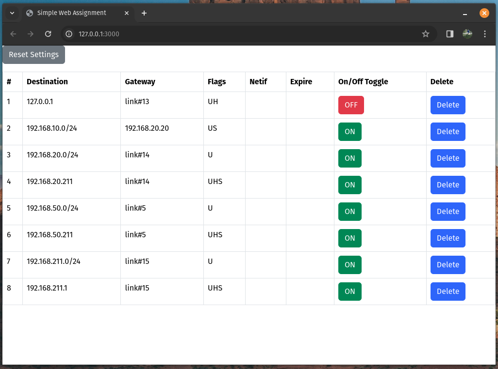

# Web Assignment

- start vscode
- shortcut `ctrl+shift+p`
- execute `Dev Containers: Rebuild Container`
- in vscode terminal execute
    - `./scripts/build_service.sh`
    - `./scripts/get_files.sh`
    - `./scripts/run_server.sh`
- browse to: http://localhost:3000/

## Architecture

- `index.php` - starting point for the application
- `js/app.js` - jquery async get/post request listening to button clicks
- `rest/routing_table.php` - rest_api to start operations
- `controller/routing_table.php` - implementation to call linux service 
- `service` - implementation of a service which provides the routing_table entries
- `table.entries` - storage to store entries

## Resources

- https://github.com/heryvandoro/simple-crud-php-oop-jquery-ajax
- https://www.php.net/docs.php
- https://api.jquery.com/
- https://api.jquery.com/jQuery.ajax/
- https://icons.getbootstrap.com/
