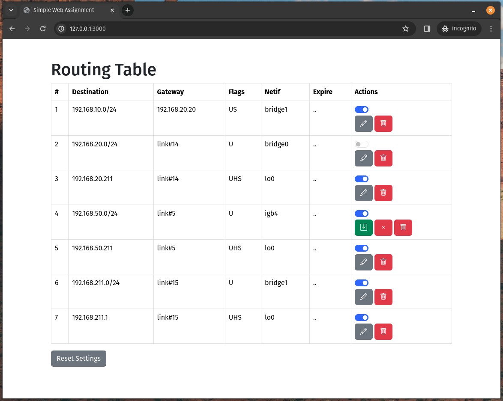

# Web Assignment

- install rust : https://rustup.rs/
- build rust service: `pushd service && cargo build && popd`
- get sources like bootstrap and jquery: `./scripts/get_files.sh`
- install php: `apt-get install php`
- start php server: `./scripts/start_server.sh`

## Resources

- https://github.com/heryvandoro/simple-crud-php-oop-jquery-ajax
- https://www.php.net/docs.php
- https://api.jquery.com/
- https://api.jquery.com/jQuery.ajax/
